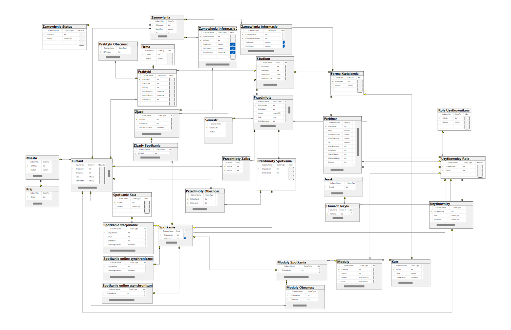

# 🧑‍🎓 Learning-platform-database-system
System bazodanowy platformy edukacyjnej opracowany w SQL podczas zajęć z przedmiotu *Podstawy baz danych* na uczelni.
## Opis
Stworzyliśmy bazę danych dla systemu do organizacji różnego rodzaju form kształcenia oferowanych przez daną firmę. Są to:
* webinary - odbywają się online na żywo, a następnie nagranie jest udostępniane uczestnikom na okres 30 dni, mogą być darmowe albo płatne,
* kursy - krótkie formy kształcenia składające się z modułów, które mogą być:
  * stacjonarne – odbywają się synchronicznie w konkretnej sali,
  * on-line synchroniczne – odbywają się na żywo na tej samej platformie co webinary, również są nagrywane,
  * on-line asynchroniczne – polegają na oglądaniu udostępnionych nagrań,
  * hybrydowe – łączą podejście on-line i stacjonarne,
* studia - długotrwałe formy kształcenia wykorzystujące zarówno spotkania stacjonarne, jak i on-line, wymagane jest odbycie praktyk i zdanie egzaminu końcowego.

Projekt jest kompletną bazą danych zawierającą wszystkie istotne tabele, procedury, funkcje i widoki, a także indeksy i uprawnienia użytkowników.  
Pełny opis wymagań do projektu znajduje się w pliku [`opis.pdf`](opis.pdf).
### 📊 Schemat bazy danych

### 🧑‍💻 Użytkownicy:
* Użytkownik (formy kształcenia)
* Kursant
* Użytkownik (harmonogram)
* Wykładowca
* Dyrektor Szkoły
* System
* Użytkownik (członkowie)
* Raportowiec
* Filmowiec
* Użytkownik (anonimowy)

## Dokumentacja
Dokumentacja projektu przechowywana jest w poniższych plikach:   
* [`tabele.md`](tabele.md) - specyfikacja tabel bazy danych  
* [`procedury.md`](procedury.md) - procedury bazy danych  
* [`widoki.md`](widoki.md) - widoki bazy danych  
* [`funkcje.md`](funkce.md) - funkcje bazy danych  
* [`indeksy.md`](indeksy.md) - indeksy bazy danych  
* [`uprawnienia.md`](uprawnienia.md) - uprawnienia dostępu poszczególnych użytkowników

## Autorzy
* Eryk Hadała
* Szymon Paja
* Tomasz Paja
